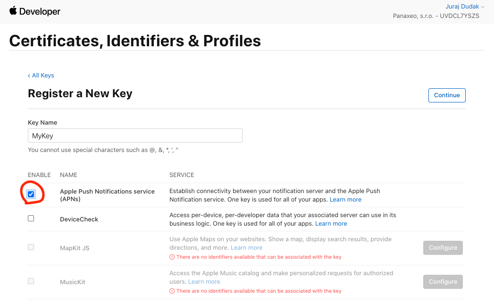
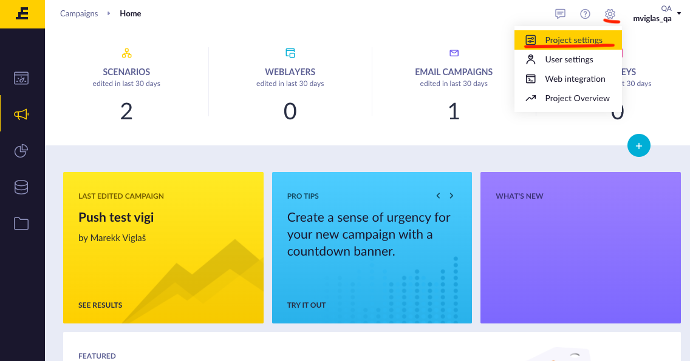
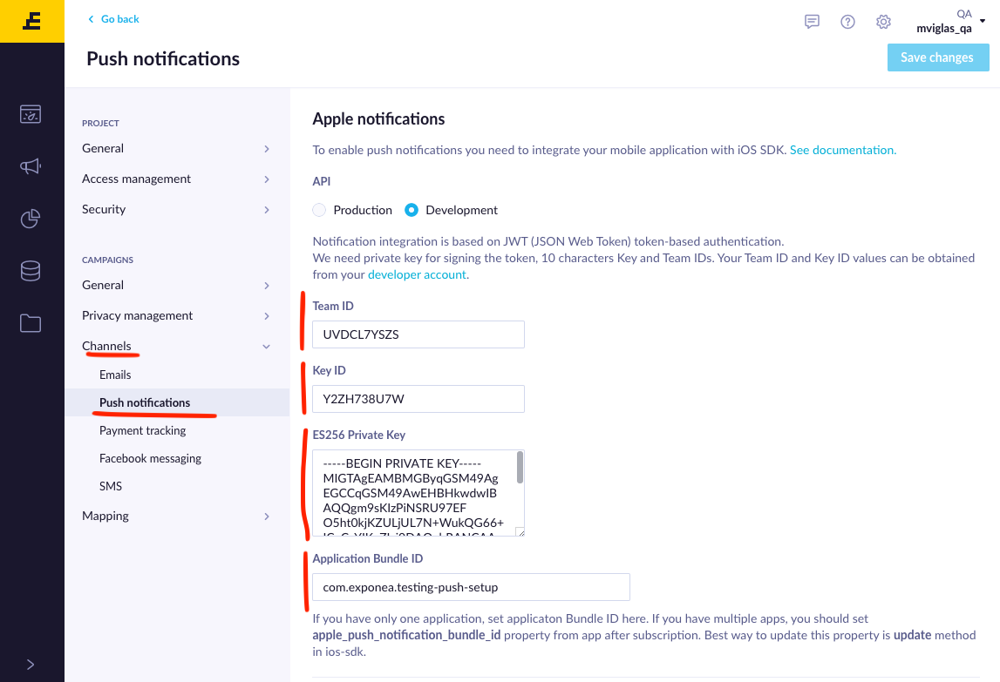

# Exponea web app push notification configuration
To be able to send push notifications from Exponea, you will need to create an Apple Push Notification service key and add it to the Exponea web app.

## Creating APNs key
1. Open your [Apple developer console](https://developer.apple.com/account/resources/authkeys/list), navigate to `Certificates, Identifiers & Profiles` and open `Keys` .

2. Add a new key and select APNs

3. Confirm the creation of the key. To configure Exponea you'll need the downloaded `p8 file`, `Team id` located in the top right corner and `Key Id`. Mark these down and you are done with configuration on Apple side.

## Adding APNs key to Exponea

1. Open your Exponea web application and navigate to `Project Settings`.

2. Go to `Channels` and select `Push notifications`. Scroll down to Apple push notifications and fill in the details. `ES256 Private Key` is the p8 file you downloaded from Apple developer portal. Open it as text file and copy-paste the contents. 

## Great job!
Exponea web application is now set up to send push notifications to your application. Once you finish [push notification setup](./PUSH_QUICKSTART.md), try [sending push notifications](./PUSH_SEND.md).