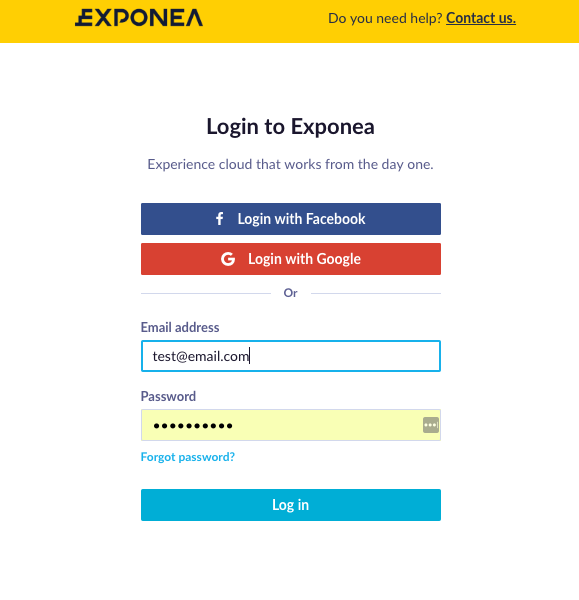
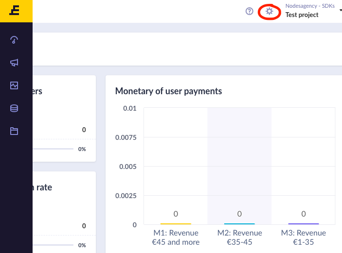
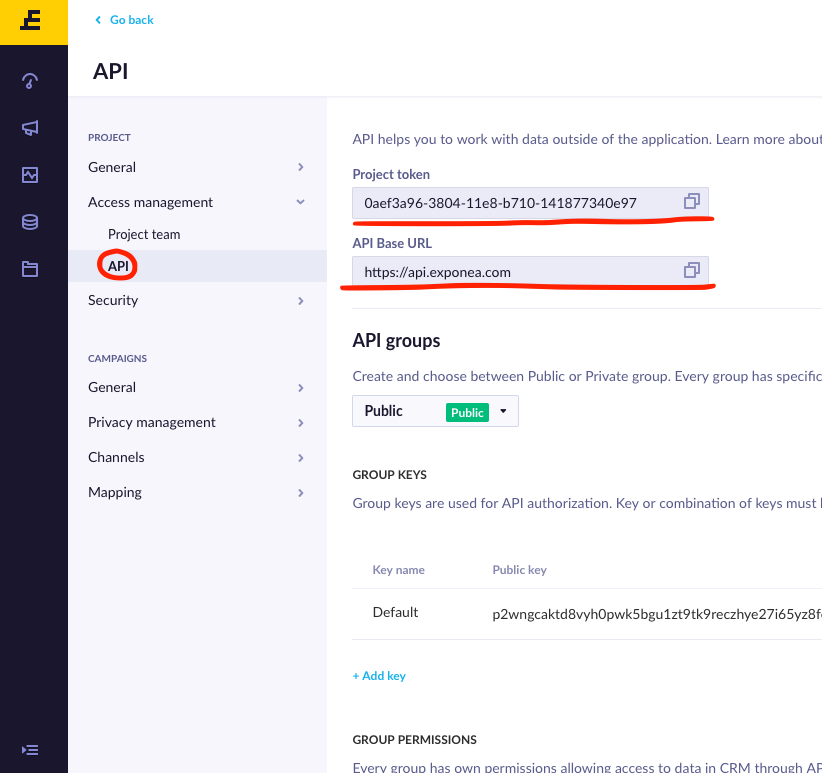

  

# Exponea Configuration

1. Open [Exponea Web app](https://app.exponea.com) and login using your credentials 

2. Choose your project in the top-right corner and navigate to Settings/Project Settings

3. In Project settings, navigate to Access Management/API. On this page you can get your `API Base URL` and `Project Token`. You'll need a **Public group** `Authorization token` to configure Exponea SDK. More information about access keys can be found in [Exponea API Reference](https://docs.exponea.com/reference#access-keys)

