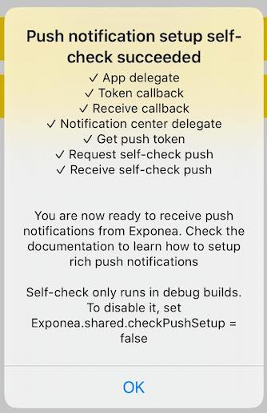
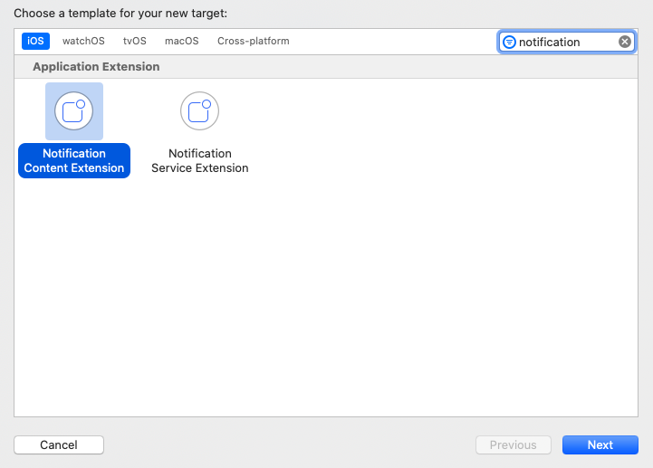
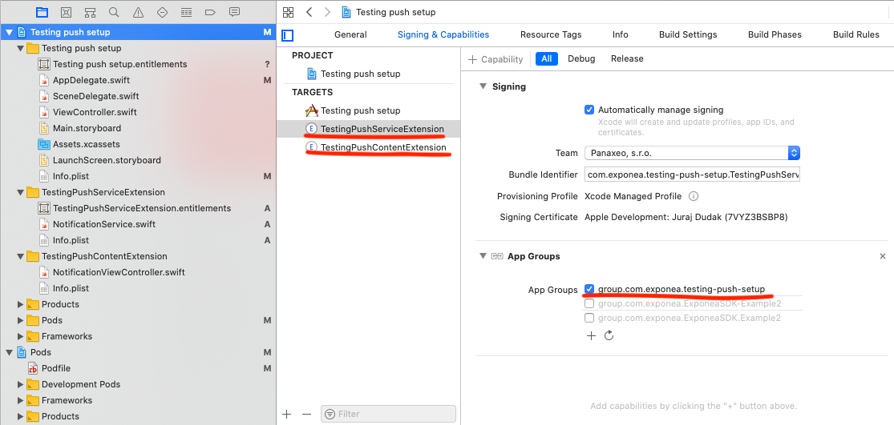
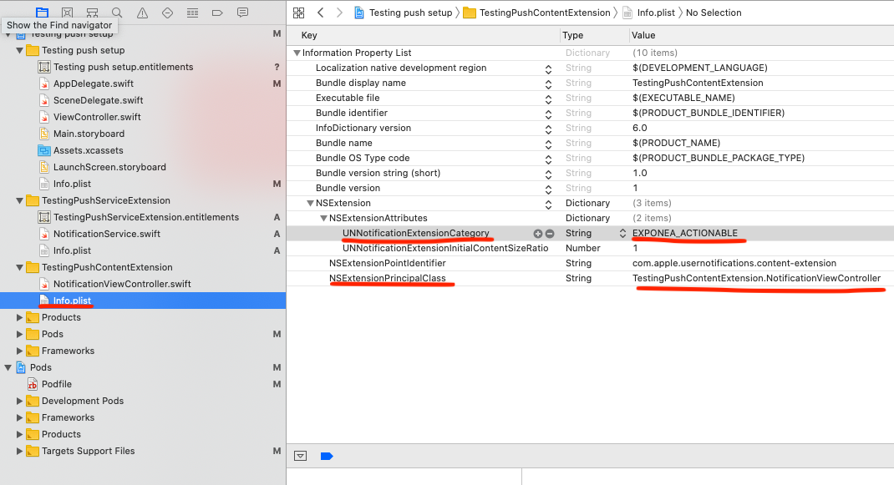

# Push notifications quick start
> In order to send push notifications, we need to track Firebase token to Exponea servers. Please make sure [tracking](./TRACKING.md) is working before configuring push notifications.

Exponea SDK contains self-check functionality to help you successfully setup push notifications. Self-check will try to track push token, request Exponea backend to send silent push to the device and check the app is ready to open push notifications. These checks correspond to steps in this guide.

To enable self-check functionality set `Exponea.shared.checkPushSetup = true` before initializing the SDK

``` swift
    Exponea.shared.checkPushSetup = true
    Exponea.shared.configure(
        Exponea.projectSettings(
            projectToken: "YOUR_PROJECT_TOKEN",
            authorization: .token("YOUR_ACCESS_TOKEN")
        ),
        pushNotificationTracking: .enabled(appGroup: "YOUR_APP_GROUP")
    )
```
## Setup process
 1. [Setting application capabilities](#1-application-capabilities)
 2. [Updating Exponea configuration](#2-configuration)
 3. [Implementing application delegate methods](#3-application-delegate-methods)
 4. [Configuring Exponea to send push notifications](#4-configuring-exponea-to-send-push-notifications)
 5. [Authorizing the application for receiving push notifications](#5-authorizing-for-receiving-push-notifications)
 6. [Rich push notifications](#6-rich-push-notifications)(optional)

## 1. Application capabilities
You need to set up capabilities for your application. To do so select your application in XCode, go to `Signing & Capabilities` and add capabilities:
 - `Push Notifications` required for alert push notifications.
 - `Background Modes` and select `Remote notifications` required for silent push notifications.
 - `App Groups` and create new app group for your app. This is required for application extensions that will handle push notification delivery and rich content.

 > In order to add `Push Notifications` capability, your Apple developer account needs to have paid membership. Without it, capability selector doesn't contain this capability at all.


## 2. Configuration
To enable push notifications, configure the SDK with `pushNotificationTracking: .enabled(appGroup:)`, use the app group created in the previous step. 

``` swift
    Exponea.shared.configure(
        Exponea.projectSettings(...),
        pushNotificationTracking: .enabled(appGroup: "YOUR_APP_GROUP")
    )
```

## 3. Application delegate methods
Application needs so to be able to respond to push notification related events.
You will need to setup 4 delegate methods:
- `application:didRegisterForRemoteNotificationsWithDeviceToken:` will be called when your application registers for push notifications.
- `application(_:didReceiveRemoteNotification:fetchCompletionHandler:)` will be called for silent push notifications and alert push notifications when your app is opened.
- `userNotificationCenter(_:didReceive:withCompletionHandler:)` will be called when user opens alert push notification.
- `application:didFinishLaunchingWithOptions` will be called with launch options containing a notification when push notification was opened while app wasn't running.

Exponea SDK contains `ExponeaAppDelegate` that contains implementation of these methods. Easiest way to integrate is make your `AppDelegate` extend `ExponeaAppDelegate`. If you don't want to/cannot use `ExponeaAppDelegate`, check implementation of those methods and call respective Exponea methods.

``` swift
@UIApplicationMain
class AppDelegate: ExponeaAppDelegate {
    override func application(
        _ application: UIApplication,
        didFinishLaunchingWithOptions launchOptions: [UIApplication.LaunchOptionsKey: Any]?
    ) -> Bool {
        // don't forget to call the super method!!
        super.application(
            application,
            didFinishLaunchingWithOptions: launchOptions
        )
        Exponea.shared.checkPushSetup = true
        Exponea.shared.configure(...)
    }
}
```

#### Checklist: 
 - your `application:didRegisterForRemoteNotificationsWithDeviceToken:` delegate method calls `Exponea.shared.handlePushNotificationToken`
 - your `application(_:didReceiveRemoteNotification:fetchCompletionHandler:)` and `userNotificationCenter(_:didReceive:withCompletionHandler:)` calls `Exponea.shared.handlePushNotificationOpened`
 - you call `UNUserNotificationCenter.current().delegate = self`
 - when you start your application, self-check should be able to receive and track push notification token to Exponea servers.

## 4. Configuring Exponea to send push notifications
To be able to send push notifications from Exponea backend, you need to connect Exponea web application to Apple Push Notification service. To do so, open Project settings in your Exponea app and navigate to Channels/Push notifications. Fill in all the field: `Team ID`, `Key ID`, `ES256 Private Key` and `Application Bundle ID`.

[Exponea web app push notification configuration](./APNS.md) guide contains screenshots showing where the data is located.

#### Checklist: 
 - when you start your application, notification setup checker should be able to send self-check silent push notification to your application. 

## 5. Authorizing for receiving push notifications
You can receive silent push notification without any permissions, but you'll need a special permission for notifications visible to the user. 
``` swift 
UNUserNotificationCenter.current()
    .requestAuthorization(options: [.badge, .alert, .sound]) { (granted, _) in
        if granted {
            DispatchQueue.main.async {
                UIApplication.shared.registerForRemoteNotifications()
            }
        }
    }
```

By default, Exponea only tracks push notification token when you're authorized (unless push setup check is enabled). To learn how to change this behavior check the detailed [Push notifications](../PUSH.md) documentation.

#### Checklist: 
 - Exponea should now be able to send push notifications to your device. To learn how, you can check the [Sending Push notifications](./PUSH_SEND.md) guide. Push notification will not display rich content just yet. We'll set it up in the next step.


## 6. Rich push notifications
iOS application needs 2 application extensions to be able to show custom image and buttons in push notifications. To create an extension, select `File/New/Target`
>  Make sure that the `iOS Deployment Target` of your extensions is the same as target for your main app. XCode will set it to latest when creating extensions.



### Dependency configuration
If you're using **Cocoapods**, add `pod 'ExponeaSDK-Notifications'` line to your Podfile under **both** the service and content extension targets and run `pod install`. If you're using **Carthage** then add the `ExponeaSDKNotifications` framework as a linked framework to the new service extension target along with the carthage script to strip unnecessary architectures.

### Notification Service Extension
Create new Notification Service Extension and give it `App Groups` capability selecting the group you created for your main app.

In the extension, you have to call Exponea methods for processing notification and handling timeouts.
``` swift
import UserNotifications
import ExponeaSDKNotifications

class NotificationService: UNNotificationServiceExtension {
    let exponeaService = ExponeaNotificationService(
        appGroup: "group.com.exponea.testing-push-setup"
    )

    override func didReceive(
        _ request: UNNotificationRequest,
        withContentHandler contentHandler: @escaping (UNNotificationContent) -> Void
    ) {
        exponeaService.process(request: request, contentHandler: contentHandler)
    }

    override func serviceExtensionTimeWillExpire() {
        exponeaService.serviceExtensionTimeWillExpire()
    }
}
```

### Notification Content Extension
Create new Notification Content Extension. By default the extension will contain storyboard file that you can delete, we'll change the default view controller implementation. Service extension that we created in the previous step will change the notification `categoryIdentifier` to `EXPONEA_ACTIONABLE`. We have to configure the content extension to display push notifications with that category. Open `Info.plist` in created content extension group and add `UNNotificationExtensionCategory`. Next, remove `NSExtensionMainStoryboard` and instead use `NSExtensionPrincipalClass` set to your view controller.

Notice the parameter `UNNotificationExtensionInitialContentSizeRatio` (with the default value 1). It specifies the ratio between the width and the height of the content in the push notification. By default, the content is as high as it’s wide. This setting is not part of the SDK, but it can cause showing white space when notification is without the content (image). Change this value to 0 if you want the height to be dynamic (it will grow to the needed height if there is an image present, but there will be no blanc space if there is not).



Your view controller class should just forward the notification to our service that will correctly display it.
``` swift
import UIKit
import UserNotifications
import UserNotificationsUI
import ExponeaSDKNotifications

class NotificationViewController: UIViewController, UNNotificationContentExtension {
    let exponeaService = ExponeaNotificationContentService()

    func didReceive(_ notification: UNNotification) {
        exponeaService.didReceive(notification, context: extensionContext, viewController: self)
    }
}
```


#### Checklist:
 - push notification with image and buttons sent from Exponea web app should be properly displayed on your device. Push delivery tracking should work.
 - if you don't see buttons in the expanded push notification, it means the content extension is **not** running. Double check `UNNotificationExtensionCategory` in the Info.plist - notice the placement inside `NSExtensionAttributes`. Check that the `iOS Deployment Target` is the same for extensions and main app.
  
## Great job!
You should now be able to use Exponea push notifications. You can disable the self-check now.

To further configure push notifications, check the complete documentation for [Configuration](../CONFIG.md) and [Push notifications](../PUSH.md)