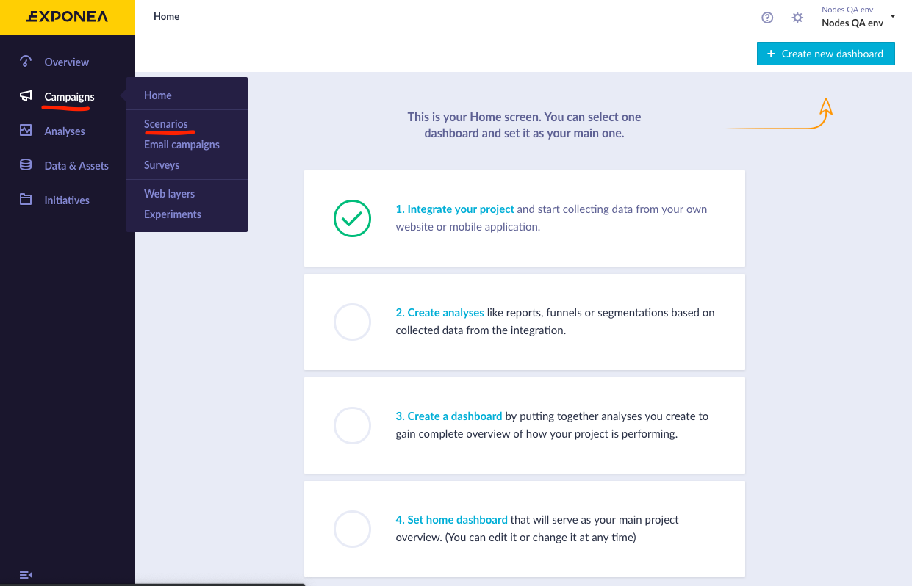
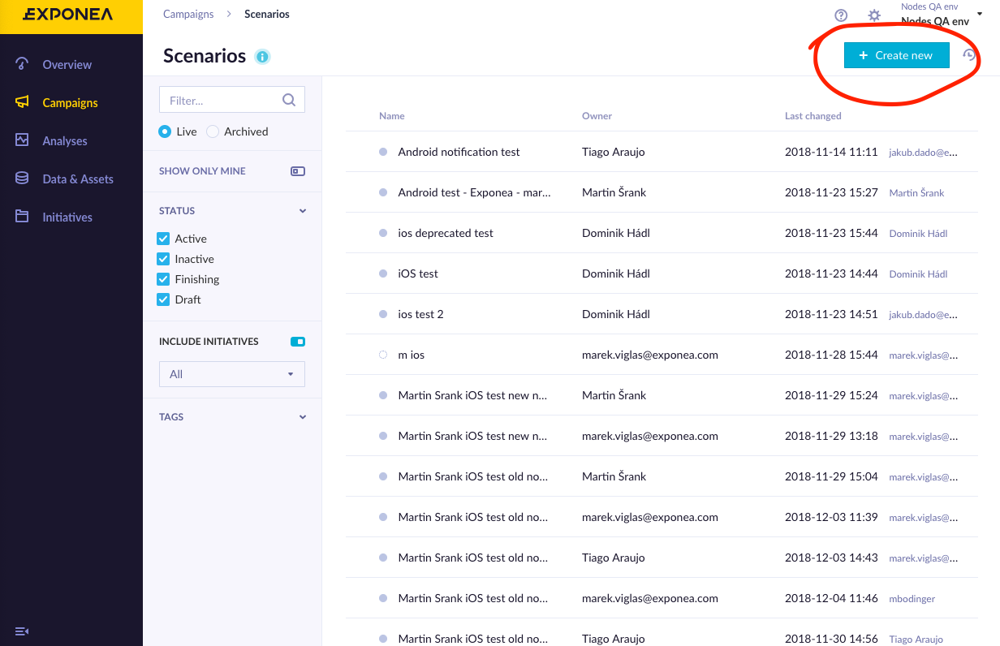
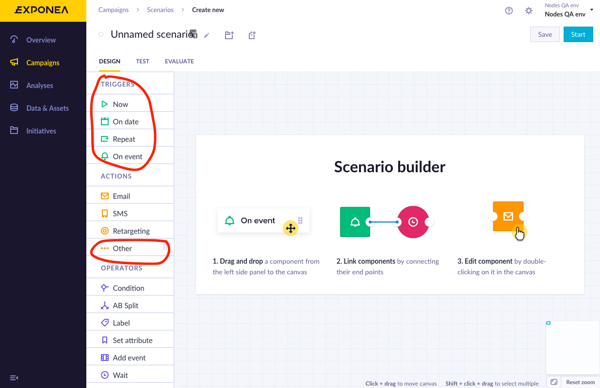
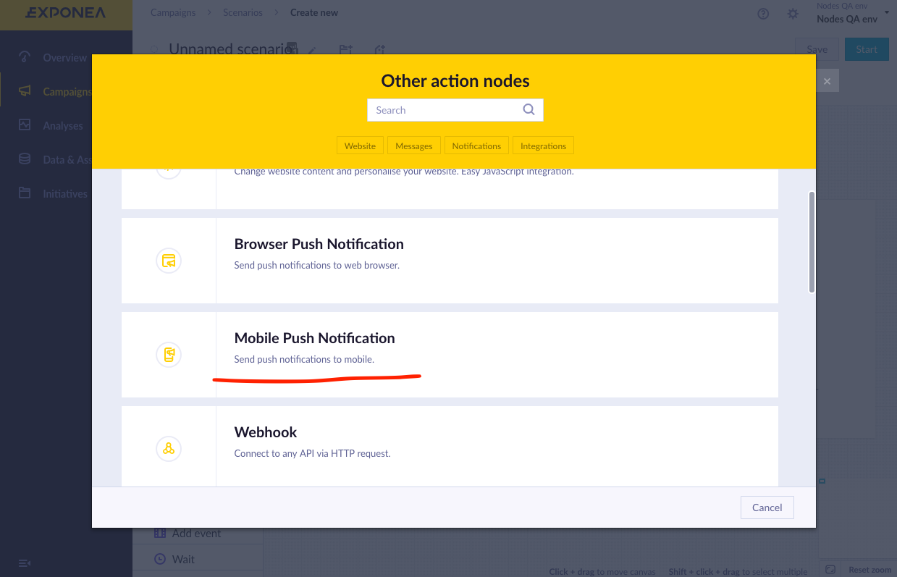
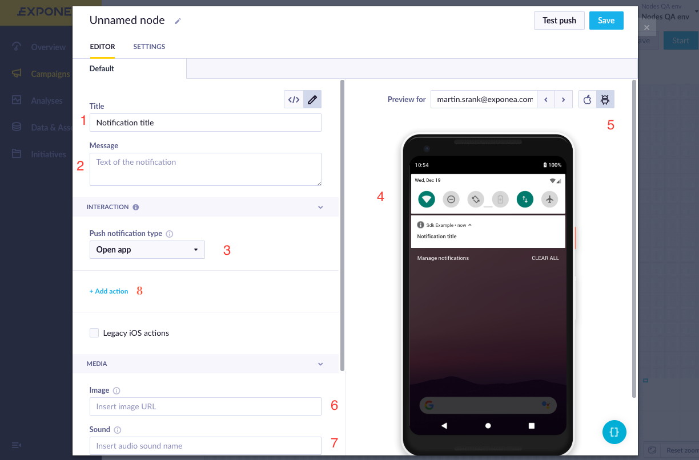
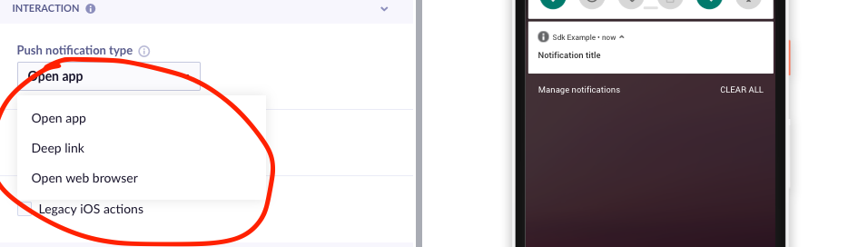
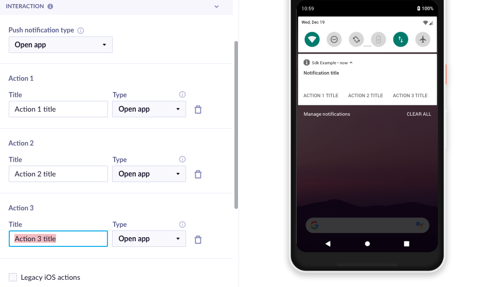
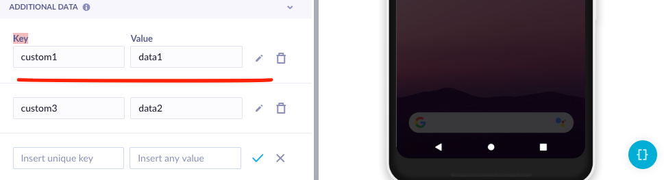
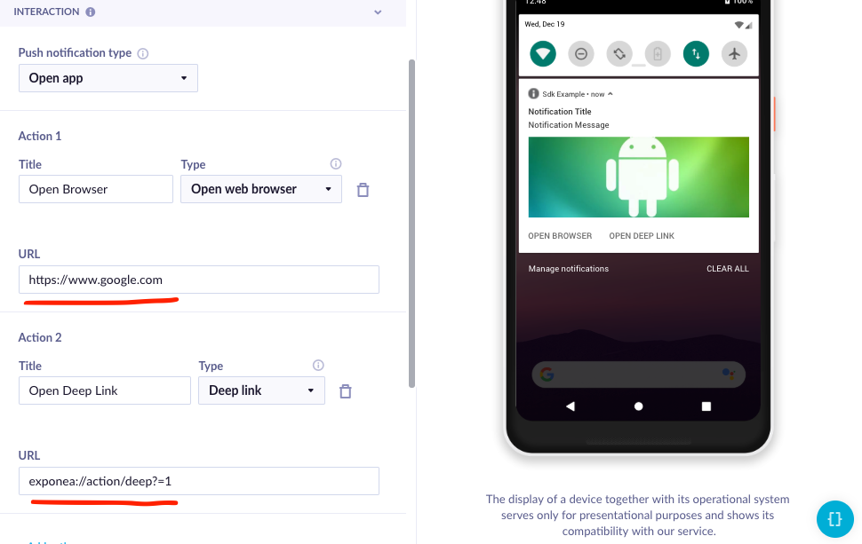

# Sending & Handling Push notifications


## Payload constructing
Exponea web app provides great notifications builder, where you can customize all the interaction and how it will be presented to users

1. First open Exponea Web App and choose **Campaigns->Scenarios** from the left menu

  

2. To create new Campaign, prees **Create new** button

  

3. This will open a **Campaign Builder** where you can specify when/how your push notification is triggered
You will need to choose a trigger and action type. To locate mobile push notification action
use **Actions->Others** and choose **Mobile Push Notifications** in pop-up menu

  

  


4. This will open notification builder. There you can specify **Title** (1) and **Message** (2) for your notification. There is a **Preview** (4) on the right side that will show what the notification is going to look like. There is also an option to specify an **Image (6)** you want to display and **Sound (9)** that will be played when notification is received.

> When specifying the sound, provide sound name without extension.



5. You can also select **Interaction** performed when user opens the notification (3). There are 3 options available:
  * Open Application
  * Open Browser
  * Open Deeplink

  

6. Additionally you can specify more **Interactions** by Pressing **Add Action button (8)**



8. Lastly, you can specify additional **Data** you want to send using key-value pairs




## Payload handling

Exponea will automatically handle interactions you've provided in **Payload Builder**
You need only to provide valid URL for browser interaction and a URI for **Deep link** like so:



### Deep link Handling

Exponea SDK notifications can handle the deeplink automatically, however if you wish to be notified of user's actions, then you need to implement a `PushNotificationsDelegate` in your application.

```swift
@UIApplicationMain
class AppDelegate: UIResponder, UIApplicationDelegate {
	func application(_ application: UIApplication,
	                     didFinishLaunchingWithOptions launchOptions: [UIApplication.LaunchOptionsKey: Any]?) -> Bool {
	     // Auth Exponea
        Exponea.shared.configure(plistName: "Exponea.plist")
        
        // Set notification delegate (needs to be done after configuring)
        Exponea.shared.pushNotificationsDelegate = UIApplication.shared.delegate as? AppDelegate
	}
}

extension AppDelegate: PushNotificationManagerDelegate {
    func pushNotificationOpened(with action: ExponeaNotificationActionType, 
                                value: String?, 
                                extraData: [AnyHashable : Any]?) {
        print("Action \(action), value: \(String(describing: value)), extraData \(String(describing: extraData)")
    }
}
```

> ⚠️ **IMPORTANT**  
> You can only set the `pushNotificationsDelegate` after you have configured Exponea, never before.