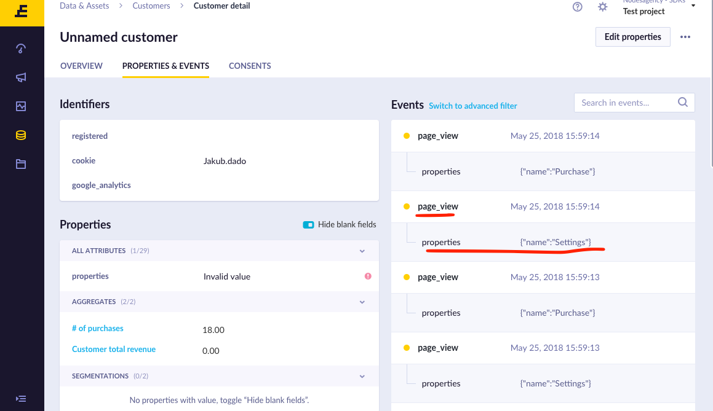
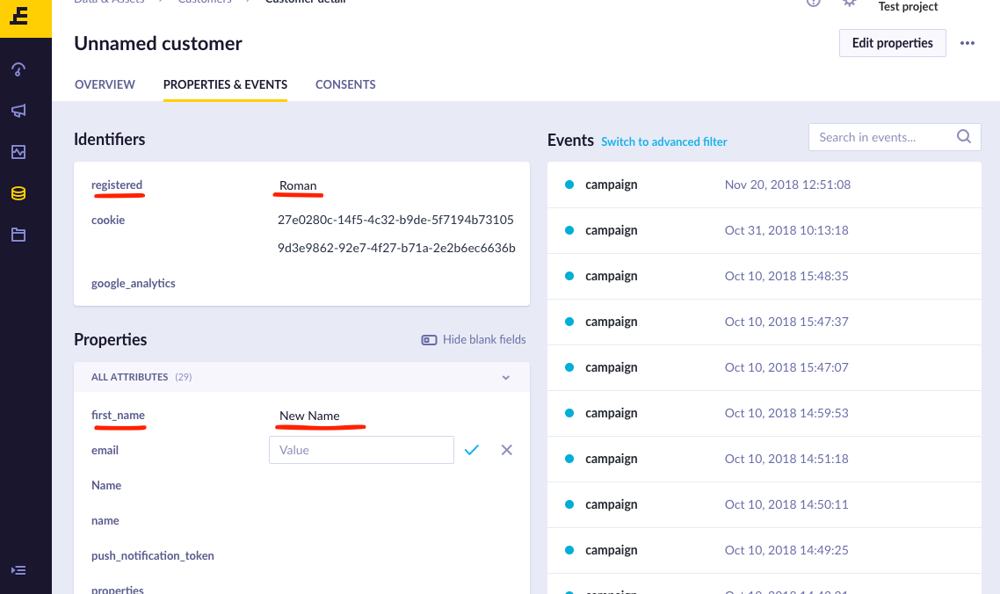

# Track Events using ExponeaSDK
You can define any event types for each of your project based on your business model or your current goals. If you have product e-commerce website, your basic customer journey will probably/most likely be:

* Visiting your App
* Searching for specific product
* Product page
* Adding product to the cart
* Going through ordering process
* Payment

So the possible events for tracking will be: ‘search’, ‘product view’, ‘add product to cart’, ‘checkout’, ‘purchase’. Remember that you can define any event names you wish. Our recommendation is to make them self-descriptive and human understandable.

By default, `ExponeaSDK` will handle some of the events automatically, this includes:

* User Session tracking
* Push Notifications
* In-app purchase

For any custom events you might come up with you can use following method

```swift
func trackEvent(properties: [String: JSONConvertible],
                timestamp: Double?,
                eventType: String?)
```

Example usage: Imagine a function that tracks which screen user opens. We can call it
Activity's `onCreate()` for example

1. First we have to create `PropertiesList` object. It holds a `HashMap`
with properties you want to track with this event. In our example want to track
name of the screen, so the  **screen name** could one of the properties we are sending

  ```swift
  let properties: [String: JSONConvertible] = ["my value": "test", "duration": 123.45]
  ```

2. Then we can pass this object to `trackEvent()` along with **eventType** (page_view) as following

  > Optionally, you can provide a custom timestamp if the event has happened at a different time.  
  > By default the current time will be used.

  ```swift
  Exponea.shared.trackEvent(properties: properties, 
  								 timestamp: nil, 
  								 eventType: "page_view")

  ```
3. You can then, go to your customers overview, and see that event was successfully tracked




# Track User Properties / User Identification

It is also possible to update the specific properties for a specific customer.

1. To better identify your users you can specify your custom identifiers by providing `[String: JSONConvertible]` like so:

  ```swift
  let customerIds: [String: JSONConvertible] = ["my_id": 1234, "email" : "my@email.com"]
  ```

2. You can also pass `PropertiesList` object with any other customer related properties,
like customer name for example

  ```swift
  let properties: [String: JSONConvertible] = ["age": 12, "first_name" : "New Name"]
  ```

3. Pass these params to `identifyCustomer()` method

	```swift
	Exponea.identifyCustomer(customerIds: customerIds,
	                         properties: properties,
	                         timestamp: nil)
	```

4. You can then check identifiers and Properties in Customer overview


 